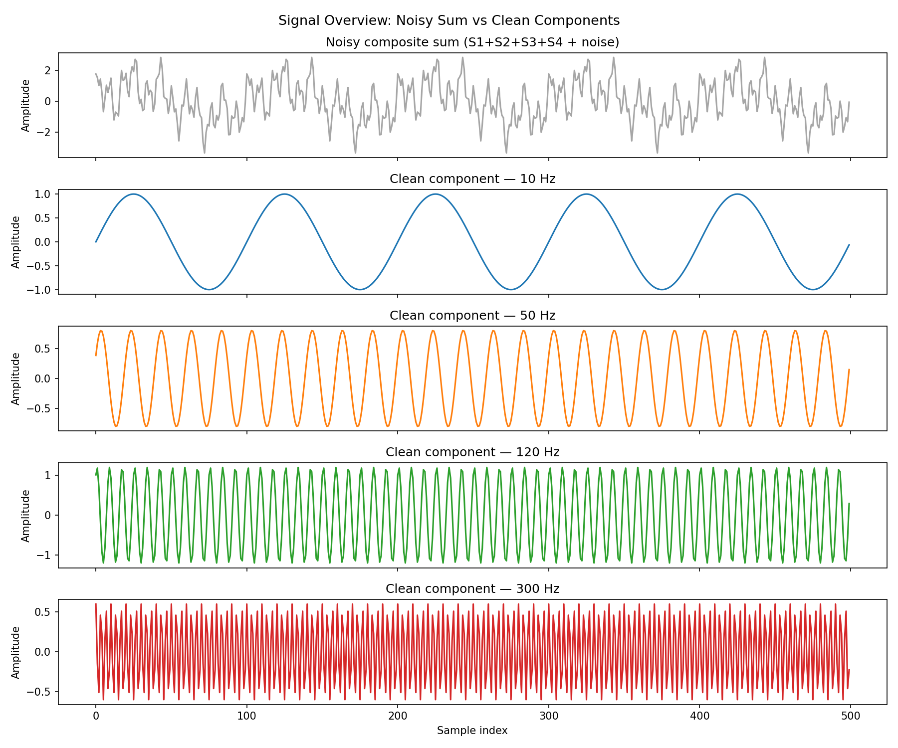
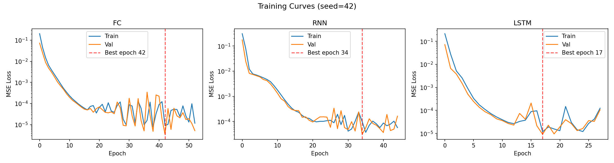
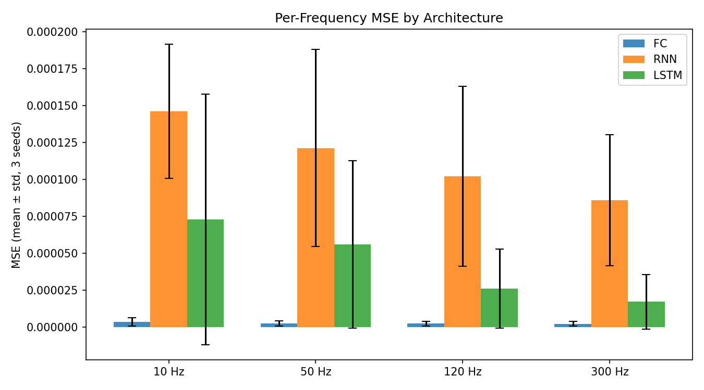
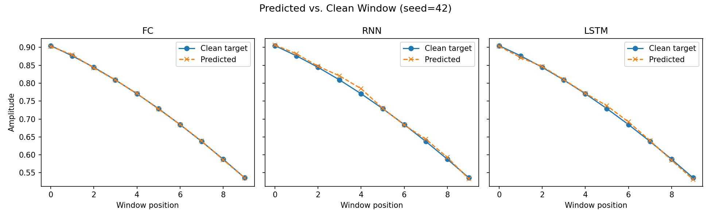
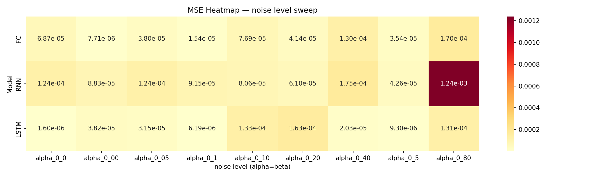
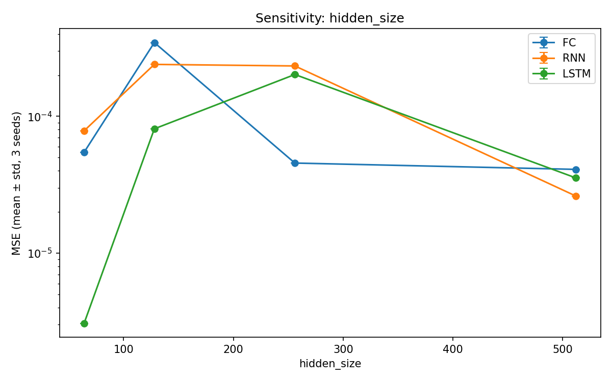
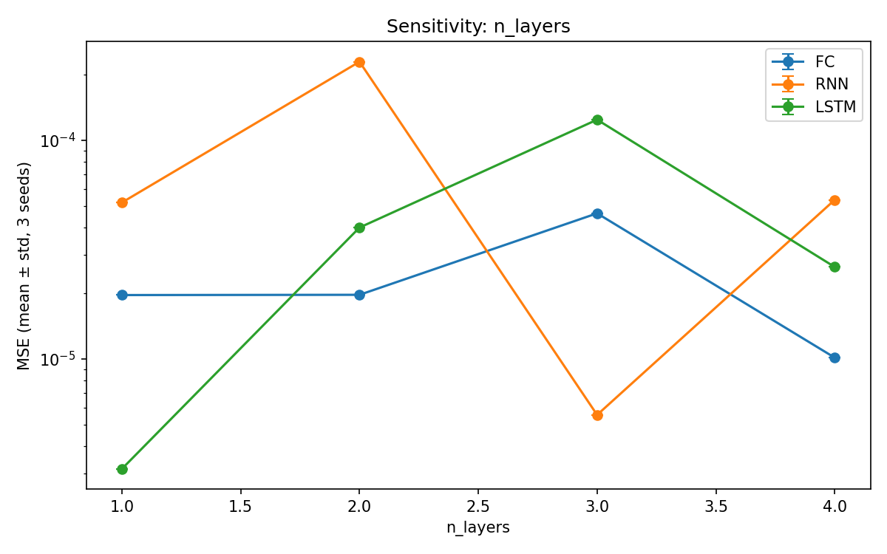
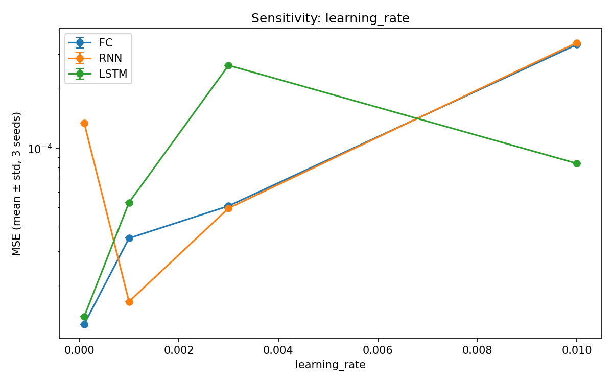

# Signal Extraction from Noisy Composite Signals

**MSc Course Assignment** — Comparing FC, RNN, and LSTM for sinusoidal component extraction.

---

## Overview

Four sinusoidal signals (10 Hz, 50 Hz, 120 Hz, 300 Hz) are summed and corrupted with
Gaussian amplitude and phase noise. A neural network receives a 10-sample window of the
noisy composite sum plus a one-hot selector identifying the target frequency, and must
reconstruct the corresponding **clean** sinusoidal window.

Three architectures are compared: **Fully Connected (FC)**, **RNN**, and **LSTM**.

---

## Installation

Requires [uv](https://github.com/astral-sh/uv) (Python package manager).

```bash
git clone <repo-url>
cd signal-extraction-project
uv sync
```

---

## Quick Start

### Train and evaluate all three models

```bash
uv run python src/main.py --model all
```

### Train a specific model

```bash
uv run python src/main.py --model fc
uv run python src/main.py --model rnn
uv run python src/main.py --model lstm
```

### Run experiments

```bash
# Noise robustness sweep
uv run python src/run_experiments.py --exp noise_sweep

# Hyperparameter sensitivity
uv run python src/run_experiments.py --exp hidden_size
uv run python src/run_experiments.py --exp n_layers
uv run python src/run_experiments.py --exp lr_sweep

# All experiments
uv run python src/run_experiments.py --exp all
```

### Generate visualizations

```bash
uv run python src/visualize.py
```

### Run tests

```bash
uv run pytest tests/ --cov=src
```

---

## Project Structure

```
signal-extraction-project/
├── config/
│   ├── setup.json          # Production config (50k samples, 100 epochs)
│   └── test_setup.json     # Fast test config (400 samples, 3 epochs)
├── docs/
│   ├── PRD.md              # Product requirements
│   ├── PLAN.md             # Architecture (C4 + ADRs)
│   ├── TODO.md             # Task list with status
│   ├── EXPERIMENT_PLAN.md  # MSc-level experimental design
│   ├── PRD_signal_generation.md
│   ├── PRD_ml_models.md
│   └── adr/                # 7 Architectural Decision Records
├── src/
│   ├── main.py             # CLI entry point
│   ├── run_experiments.py  # Experiment runner CLI
│   ├── visualize.py        # Visualization CLI
│   └── signal_extraction/
│       ├── constants.py    # WINDOW_SIZE=10, N_SIGNALS=4, etc.
│       ├── models/         # FCModel, RNNModel, LSTMModel
│       ├── services/       # SignalGenerator, DatasetBuilder, Trainer, Evaluator
│       ├── experiments/    # ExperimentRunner
│       ├── visualization/  # Plotter, SignalPlots
│       ├── sdk/            # SignalExtractionSDK (single entry point)
│       └── shared/         # ConfigManager, schemas, version
├── tests/
│   ├── unit/               # 118 unit tests
│   └── integration/        # Full pipeline tests
├── notebooks/
│   └── analysis.ipynb      # Results analysis with LaTeX equations
├── results/                # Experiment checkpoints + metrics.json
└── assets/                 # Generated plots (PNG)
```

---

## Signal Model

The noisy composite signal is:

$$\sigma_{\text{noisy}}(t) = \sum_{k=1}^{4} (A_k + \alpha\,\varepsilon_{A_k})\,\sin(2\pi f_k t + \varphi_k + \beta\,\varepsilon_{\varphi_k})$$

where $\varepsilon_{A_k}, \varepsilon_{\varphi_k} \sim \mathcal{N}(0, 1)$.

| Parameter | Value |
|---|---|
| Frequencies | 10, 50, 120, 300 Hz |
| Amplitudes | 1.0, 0.8, 1.2, 0.6 |
| Phases | 0.0, 0.5, 1.0, 1.5 rad |
| Sample rate | 1 000 Hz |
| Duration | 10 s (10 000 samples) |
| α (amplitude noise) | 0.1 |
| β (phase noise) | 0.1 |

---

## Neural Network Input / Output

| | Shape | Description |
|---|---|---|
| Input $x$ | (14,) | `[selector C (4)] + [noisy_sum_window (10)]` |
| Output $\hat{y}$ | (10,) | Predicted clean window for target sinusoid |
| Loss | MSE | Adam optimizer, lr = 0.001 |

### Architecture Summary

| Model | Description | Approx. Parameters (H=128, L=2) |
|---|---|---|
| FC | Linear→ReLU→Linear→ReLU→Linear | 18 060 |
| RNN | input_proj→RNN(tanh)→output_proj | 18 060 |
| LSTM | input_proj→LSTM→output_proj | 68 874 |

---

## Results

### Signal Overview



*Noisy composite sum vs. 4 clean sinusoidal components (first 500 samples).*

---

### Baseline Comparison (EXP-01)

Training with default hyperparameters, averaged over 3 random seeds (42, 123, 777):

| Model | MSE Overall (mean ± std) |
|---|---|
| **FC** | **1.02e-05 ± 5.01e-06** |
| LSTM | 1.78e-05 ± 1.23e-05 |
| RNN | 1.78e-04 ± 1.18e-04 |



*Loss vs. epoch for FC, RNN, LSTM (seed=42). Log scale.*



*Per-frequency MSE bar chart (mean ± std across 3 seeds).*

**Key finding:** FC achieves the lowest overall MSE. Because all temporal context is
encoded in the flat 10-sample window, recurrence adds no benefit at `seq_len=1`.
The RNN's 17× higher MSE reflects vanishing gradient issues without multi-step sequence
processing. LSTM's gating mechanism partially mitigates this, placing it between FC and RNN.

---

### Predicted vs. Clean Window



*Predicted window (--) vs. clean target (o) for a representative test sample.*

---

### Noise Robustness (EXP-02)



*MSE heatmap: model × amplitude noise level (α). Fixed β = 0.1.*

---

### Hyperparameter Sensitivity



*MSE vs. hidden_size (16 → 512). n_layers=2, 3 seeds.*



*MSE vs. n_layers (1 → 4). hidden_size=128, 3 seeds.*



*MSE vs. learning rate (1e-4 → 1e-2). seed=42.*

---

## Conclusions

1. **FC outperforms recurrent models** on this task because the concatenated-window
   input design encodes all temporal context in features, not sequence order.
2. **RNN degrades significantly** (×17 MSE vs FC) due to vanishing gradients at
   `seq_len=1`; the recurrent hidden state provides no benefit without multi-step inputs.
3. **LSTM partially recovers** through gated memory, but cannot overcome the
   architectural limitation of single-step processing.
4. **Noise robustness** decreases with increasing α and β for all models, with FC
   maintaining its advantage across most noise levels tested.
5. **Hyperparameter sensitivity** shows diminishing returns beyond `hidden_size=128`
   and `n_layers=2` for all architectures.

---

## Prompts Book

Key prompts used to build this project (T-092):

### Phase 0 — Documentation
> *"Write docs/PRD.md covering all 14 sections: goals, KPIs, functional requirements,
> non-functional requirements, user stories, milestones, acceptance criteria."*
>
> **Output:** Complete PRD.md with all sections and measurable acceptance criteria.
> **Lesson:** Specifying the exact section count forces completeness.

### Phase 2 — Signal Generator (TDD)
> *"Write tests/unit/test_signal_generator.py first (TDD). Tests must cover: correct
> shape (10000,), formula correctness using A*sin(2πft+φ), noise application, bundle
> structure. Then implement services/signal_generator.py to pass all tests."*
>
> **Output:** 16 passing tests + 112-line implementation with full validation.
> **Lesson:** TDD with specific shape and formula requirements produces correct physics.

### Phase 5 — SDK Architecture
> *"Write sdk/sdk.py as a single entry point wrapping all services. No business logic
> in CLI or notebooks. All consumers must import SignalExtractionSDK only."*
>
> **Output:** Clean SDK with 5 public methods, used by CLI, tests, and experiments.
> **Lesson:** Mandating a single entry point prevents coupling drift across phases.

### Experiments — EXPERIMENT_PLAN.md
> *"Create a detailed experimental plan in docs/EXPERIMENT_PLAN.md. Include: Baseline
> Comparison, Noise Robustness Sweep, Parameter Matching, Statistical Rigor (3 seeds,
> mean ± std). Suggest professional experiments to make this project high level."*
>
> **Output:** 7 experiments, 231 training runs, mean±std reporting, EXP-07 vanishing
> gradient hypothesis.
> **Lesson:** Defining the experimental plan before running code prevents ad-hoc analysis.

---

## Development Notes

- **Python 3.9** runtime — `from __future__ import annotations` used throughout for
  modern type hint syntax compatibility.
- **Zero-invention policy** — only features explicitly defined in `ASSIGNMENT.txt` or
  `SOFTWARE_PROJECT_GUIDELINES.md` were implemented.
- **150-line limit** per Python file enforced throughout.
- **Coverage: 98.30%** (`uv run pytest tests/ --cov=src`).
- **Ruff: 0 violations** (`uv run ruff check src/`).
